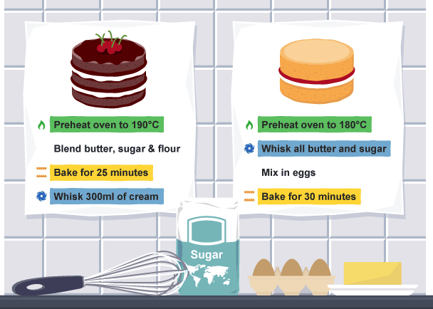

#  Computational Thinking

### LEARNING OBJECTIVES
*After this lesson, you will be able to:*

- Gain an overview of what computational thinking means.
- Explain different practices of computational thinking and how they relate to computers.
- Explain the importance of decomposition, pattern recognition, abstraction, and algorithms. 

### STUDENT PRE-WORK
*Before this lesson, you should:*

- Watch this short [video](https://www.youtube.com/watch?v=SVVB5RQfYxk) on how Google uses computational thinking.


### INSTRUCTOR PREP
*Before this lesson, instructors will need to:*

- Write learning objectives on board.
- Make sure wifi network and password (GA Guest, yellowpencil) is written on board.


### WORKSHOP AGENDA

| TIMING  | TYPE  | TOPIC  |
|:-:|---|---|
| 5 min  | [Opening](#opening)  | Greetings + Objectives  |
| 15 min  | [Introduction](#intro1)   | What is Computational Thinking? |
| 15 min  | [Computers](#computers)  | How does Computational Thinking Relate to Computers? |
| 10 min  | [Decomposition](#decomposition)  | More on Decomposition |
| 10 min  | [Patterns](#patterns)  | More on Patterns |
| 10 min  | [Abstraction](#abstraction)  | More on Abstraction |
| 10 min  | [Algorithms](#algorithms)  | More on Algorithms |
| 15 min  | [Independent Practice](#ind-practice1)  | Bringing it Together: Practice |


<a name="opening"></a>
### Review Learning Objectives(5 min)

Let's start off by reviewing the learning objectives. First and foremost, we'll gain an overview of computational thinking. We'll also get to understand the various approaches used in computational thinking and what it means to "think like a programmer." We'll end with an exercise that has you apply all the approaches discussed.

<a name="intro1"></a>
## Introduction: What is Computational Thinking?(15 min)

> Instructor Note: In the following section, students will discover what computational thinking is. Discuss the topics below. When applicable,  ask students to define, explain, or recall any **specific** elements relating to the current topic.

**Computational thinking** is a problem solving process that includes:

- **Decomposition**: Breaking down data, processes, or problems into smaller, manageable parts."
- **Pattern Recognition**: Observing patterns, trends, and regularities in data.
- **Abstraction**: Identifying the general principles that generate these patterns. This involves filtering out the details we do not need in order to solve a problem.
- **Algorithm Design**: Developing the step by step instructions for solving this and similar problems.


**Scenario Based Application**

- Historically, a recession occurs in the United States every four to seven years. Studying the patterns that lead to this is an example of what?

> Instructor Note: Answer - pattern recognition

- Matt is a first grader and he is asked to describe how to draw a cat. In order to a draw a cat Matt needs to know that a cat has a tail, fur, and eyes. He does not need to know what sound a cat makes or what a cat likes to eat. What is this an example of?

> Instructor Note: Answer - abstraction

- If Carmen is asked to read the poem <i>Fire and Ice</i> by Robert Frost. She is then asked to analyze the meter, rhyme, imagery, structure, tone, diction, and meaning of the poem. What is this an example of?

> Instructor Note: Answer - decomposition

- You have been asked to share your favorite recipe for chocolate chip cookies. You write down the step by step instructions that must be followed to ensure the perfect chewy cookie. What is this an example of?

> Instructor Note: Answer - algorithm
>
>
**Why is this important?**:

> "Computational thinking gives students the freedom and flexibility in finding new effective solutions supported by analysis and validation of the results. It helps students decompose the problem into manageable steps, employ abstraction to deal with complexity, recognize patterns and create scalable algorithms to solve real world problems. Another important skill associated with Computational Thinking is the ability to collect and analyze data using proper tools and techniques to derive meaningful conclusions.” (Work in Progress: Teaching Computational Thinking in Middle and High School)


<a name="computers"></a>
## How does Computational Thinking Relate to Computers?(10 min)

Getting computers to help us solve a real-world problem involves first thinking about what steps need to be taken to solve the problem. We then need to use our technical skills to actually get the computer to follow a series of steps. Although it is sometimes thought that computers do much of the heavy lifting, we actually need to tell the computer exactly what steps to follow and in what order. For example, imagine that you are creating a login system for your cool new website. You need to tell the computer that if a user is visiting your site for the first time you need him or her to sign up, and that you want to securely store their username and password in a database. However, if your user is a returning client, you want to allow him or her to enter in their username and password and check whether or not those credentials match what is stored. You then need to specify what happens next - is your user redirected to their profile or some other page?

**Challenge 1**: Below you will find various applications of computational thinking as it is related to computer science. Fill in this table based on what you know about decomposition, pattern recognition, abstraction, and algorithms.

| TYPE  | Application |
|---|---|
| | Realize complex data structures require less code than complex programming  |
| | Visualize data comparing microchip material and computer speed to notice a trend |
| | Write a computer program to sort data |
| |Break a computational graph problem into 4 sections, each one to be completed by a different computer processor |

> Instructor Note: The answers are as follows: abstraction, pattern recognition, algorithms, decomposition.

**Challenge 2**: Let's visit [Robby's Resume](http://www.rleonardi.com/interactive-resume/) together. With a partner I would like you to discuss how computational thinking was applied when creating this website. Here are some guiding questions that you should discuss with your partner:

If tasked with the challenge of creating an interactive resume,

- how would Robby break this challenge in to smaller more approachable pieces? (decomposition)
- what patterns could Robby come up with to help him streamline his creation process? (pattern recognition)
- what principles govern these patterns and what can we filter out when thinking about how to approach this challenge? (abstraction)
- what are the specific steps that would need to be followed to create one aspect of the site? (algorithm)

> Instructor Note: When students wrap up with their partner, have the class come together as a whole. Ask for various groups to share what they came up with.


>**Check:** In your own words, how would you describe the different components of computational thinking? What is an example of decomposition, pattern recognition, abstraction, and algorithm design?

<a name="decomposition"></a>
##More on Decomposition
Decomposition involves breaking down a complex problem in to smaller parts that are more approachable and easier to comprehend. If you do not decompose a problem, the problem can seem overwhelming and harder to solve. Breaking a problem down in to smaller pieces, in turn means that you can examine each smaller piece in detail.

**Challenge**: Solve the following riddle, approach it by using decomposition.

A detective who was mere days away from cracking an international oil smuggling ring has suddenly gone missing. While inspecting his last-known location, officers find a note:

710 57735 34 5508 51 7718

Currently there are 3 suspects: Bill, John, and Todd.

Can you break the detective's code and find the criminal name?

> Instructor Note: Some questions you can ask to help guide students: a) how can we break this problem in to smaller pieces? b) what are the important pieces of information in this riddle? c) What do we know? What do we need to find out?

<a name="patterns"></a>
##More on Recognizing Patterns(10 min)
Pattern recognition involves finding similarities among different problems or even amongst the small decomposed pieces of a more complex problem. This approach is important because problems are easier to solve when they share patterns. 

**Challenge**: In the diagram below, what are some common patterns that you notice when steps are described for making each cake?



>Instructor Note: some patterns students could point out are "preheat the oven to specific temperature," "bake for a specific time"

<a name="abstraction"></a>
##More on Abstraction(10 min)
Abstraction involves filtering out what we do not need to better concentrate on what we do need to solve a problem. This is an important strategy because 

**Challenge**: Use abstraction to answer the following questions. 

a) In all daily planners, no matter the color or design, what should you find? 
>Instructor Note: represent a week in terms of days and hours

b) In all world maps, what is needed to describe the location of a specific place?
>Instructor Note: latitude and longitude


<a name="algorithms"></a>
## More on Algorithms(10 min)

To reiterate an algorithm is comprised of a series of step-by-step instructions that can be used to solve a problem or carry out a task. Algorithms are very detailed and also sequential. It is possible to develop an algorithm or test it without writing any code, but technology can be quite useful for carrying out many steps of an algorithm more quickly.

**Challenge**: With a partner, write the steps that would need to be following for an application that would monitor the room temperature and adjust it so the room remains at a certain temperature.

Again, the goal is to think through the problem and break it down into simple steps.

>Instructor Note:

>Example answer:

```js
get targetTemperature
targetTemperature = 72
repeat forever

  currentTemperature = get sensor reading
  if currentTemperature < targetTemperature,
    turn on heater
  if currentTemperature >= targetTemperature,
    turn off heater
```

>Walk through the problem and have a couple students share what they come up with. At this point students might not have the best idea of how to name variables etc., but that's okay! Focus on the logic here.

<a name="ind-practice1"></a>
## Bringing it Together: Practice(15 min)

> Instructor Note: In the following section, students will apply computational thinking to a problem. When you ask them the questions listed under each section(decomposition, pattern recognition, abstraction, and algorithms) have them take a moment to work with a neighbor and reflect on the questions you are asking. Once the whole class seems to be done discussing with partner, bring class together and ask someone to share what they came up with.

**Challenge**: I want you to sum up all of the numbers between 1 & 200. Let's break down this problem.

- Let's start with **decomposition**. How can we break up this problem in to smaller, more approachable pieces? Hint: begin adding pairs at the ends of the range, e.g 200+1.  

- Now let's move in to **pattern recognition**. As you added the pairs  at the ends of the range above, what pattern arose if any? What does this tell us? If the pairs all add up to the same number, how many of these pairs will we have?

- Next, let's apply **abstraction**. What can we pull from the pattern and apply to the sum of the numbers in any range that begins with 1, say for example 1 & 5,000. Focus in only on the principles that really matter and would impact any problem like this one.

- Let's now end by creating an **algorithm**. You will essentially be coming up with sequential steps that could be applied when trying to find the sum of all the numbers in any range that begins with 1.

> Instructor Note: Have students refine their steps, till they get something like, in order to add all the numbers between 1 to blank, you follow this formula: ("blank"/2) * ("blank"+1). Once students have refined their algorithm, debrief and discuss "what can we draw from this exercise of using computational thinking?"


