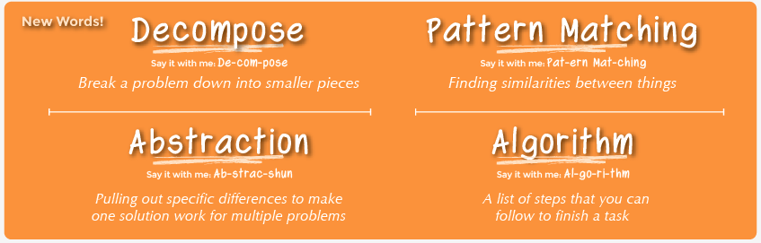

#  Computational Thinking

### LEARNING OBJECTIVES
*After this lesson, you will be able to:*

- Gain an overview of what computational thinking means.
- Explain different practices of computational thinking. 
- Explain what it means to think like a programmer. 
- Practice programmatic thinking by writing pseudo-code. 

### STUDENT PRE-WORK
*Before this lesson, you should:*

- Watch this short [video](https://www.youtube.com/watch?v=SVVB5RQfYxk) on how Google uses computational thinking.


### INSTRUCTOR PREP
*Before this lesson, instructors will need to:*

- Write learning objectives on board.
- Make sure wifi network and password (GA Guest, yellowpencil) is written on board.


### WORKSHOP AGENDA

| TIMING  | TYPE  | TOPIC  |
|:-:|---|---|
| 10 min  | [Opening](#opening)  | Greetings + The GA Experience  |
| 15 min  | [Introduction](#intro1)   | What is Computational Thinking? |
| 15 min  | [Independent Practice](#ind-practice1)  | Bringing it Together: Practice |
| 5 min   | [Pseudo Code](#pseudo-code)  | Pseudo Code|
| 10 min  | [Independent Practice](#ind-practice2)   | Thermostat |

<a name="opening"></a>
## Opening: Greetings + The GA Experience (10 min)

Did you know that there are over one billion websites that are live today? You're able to reach so many people by creating websites that distribute your ideas in a unique way. In this workshop, we'll be learning the building blocks, the type of thinking(computational thinking) that is so important to get you to soon bring your ideas to life and solve problems more effectively.

### Review Learning Objectives

Let's start off by reviewing the learning objectives. First and foremost, we'll gain an overview of computational thinking. We'll also get to understand the various approaches used in computational thinking and what it means to "think like a programmer." We'll end with discussing the importance of planning and writing out pseudocode (the actions or logic behind our applications). 

### Peer Introductions

>Instructor Note: Ask each student to share their first name and answer the following question: "What brought you here today?."

<a name="intro1"></a>
## Introduction: What is Computational Thinking? (15 min)

> Instructor Note: In the following section, students will discover what computational thinking is. Discuss the topics below. When applicable,  ask students to define, explain, or recall any **specific** elements relating to the current topic.

The process of going from an idea to a fully developed and launched product is pretty cool! However, there are many components to building a product that allows for the type of functionality most clients seek today such as in an e-commerce website or a neat new camera lens. This process should always begin with something called computational thinking. Let's figure out with this means together. 

**Computational thinking** is a problem solving process that includes:

- **Decomposition**: Breaking down data, processes, or problems into smaller, manageable parts."
- **Pattern Recognition**: Observing patterns, trends, and regularities in data.
- **Abstraction**: Identifying the general principles that generate these patterns.
- **Algorithm Design**: Developing the step by step instructions for solving this and similar problems. 



**Why is this important?**: 

"Computational thinking gives students the freedom and flexibility in finding new effective solutions supported by analysis and validation of the results. It helps students decompose the problem into manageable steps, employ abstraction to deal with complexity, recognize patterns and create scalable algorithms to solve real world problems. Another important skill associated with Computational Thinking is the ability to collect and analyze data using proper tools and techniques to derive meaningful conclusions.” (Work in Progress: Teaching Computational Thinking in Middle and High School)


>**Check:** In your own words, how would you describe the different components of computational thinking? What is an example of decomposition, pattern recognition, abstraction, and algorithm design?

<a name="ind-practice1"></a>
## Bringing it Together: Practice(15 min)

I want you to sum up all of the numbers between 1 & 200. Let's break down this challenge. 

- Let's start with **decomposition**. How can we break up this problem in to smaller, more approachable pieces? Hint: begin adding pairs at the ends of the range, e.g 200+1.  

- Now let's move in to **pattern recognition**. As you added the pairs  at the ends of the range above, what pattern arose if any? What does this tell us? If the pairs all add up to the same number, how many of these pairs will we have?

- Next, let's apply **abstraction**. What can we pull from the pattern and apply to the sum of the numbers in any range that begins with 1, say for example 1 & 5,000. Focus in only on the principles that really matter and would impact any problem like this one. 

- Let's now end by creating an **algorithm**. You will essentially be coming up with sequential steps that could be applied when trying to find the sum of all the numbers in any range that begins with 1. 

> Instructor Note: Have students refine their steps, till they get something like, in order to add all the numbers between 1 to blank, you follow this formula: ("blank"/2) * ("blank"+1). Once students have refined their algorithm, debrief and discuss "what can we draw from this exercise of using computational thinking?" 

<a name="pseudo-code"></a>
## Pseudo Code (10 min)

Before we start writing any code, we'll learn a bit about how to plan out your code by writing pseudocode. What is pseudocode? Well, to put in simple terms, it's a way to 'plan out' your program in plain English before coding it, which will make the coding process infinitely more seamless! It will serve as a detailed yet readable description of what a computer program must do. Pseudo code is technically a way to apply computational thinking when preparing to write code. 

Take, for example, a program that lets a player know whether he or she has passed the current level. Pseudo code for this program might look like the following:

```js

passingScore = 50 points
get playerScore


if playerScore >= passingScore
    display message "Current level: Passed"
otherwise
    display message "Current level: Failed"

```

Again, the goal is to think through the problem and break it down into simple steps, which can then be written out in code. Since there are no formal rules as to how pseudo code must be written, each person's version will likely vary slightly. Indentation is often used to keep statements organized and grouped together.

> **Check**: "Why do you think it is important to plan out your program before coding it?"


<a name="ind-practice2"></a>
## Independent Practice of Psuedo Code: Thermostat (10 min)

With a partner, write pseudo code for an application that would monitor the room temperature and adjust it so the room remains at a certain temperature.

1. Open up a text editor
2. Type in your pseudocode in the text editor


Example answer:

```js
get targetTemperature
targetTemperature = 72
repeat forever

  currentTemperature = get sensor reading
  if currentTemperature < targetTemperature,
    turn on heater
  if currentTemperature >= targetTemperature,
    turn off heater
```

>Instructor Note: Walk through the problem and have a couple students share what they come up with. At this point students might not have the best idea of how to name variables in the pseudocode, but that's okay! Focus on the logic here.

